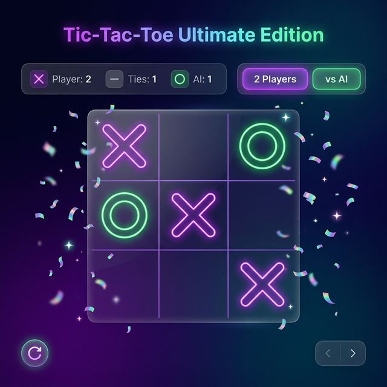

<div align="center">

# ⚡ Tic-Tac-Toe — Ultimate Edition ⚡



A **stunning, perfectly polished Tic-Tac-Toe web game** built with **React and Vite**. Challenge an unbeatable AI or battle a friend in hot-seat mode — all wrapped in a sleek dark-mode UI featuring glassmorphism cards, glowing neon styles, fluid animations, and satisfying confetti celebrations!

---

### [🚀 Live Demo Here](https://tic-tac-toe-ashy-delta-12.vercel.app/) <!-- Add your deployment link here -->

</div>

## ✨ Key Features

- 🤖 **Adaptive AI Opponent:** Play against three difficulty tiers: **Easy** (Random), **Medium** (Mixed), and **Hard** (Unbeatable Minimax with Alpha-Beta Pruning).
- 👥 **Classic 2-Player Mode:** Hot-seat play for challenging friends locally.
- 🏆 **Dynamic Score Tracking:** Persistent memory of X wins, O/AI wins, and Draws throughout your session.
- 🎉 **Victory Celebrations:** CSS-powered, physics-style confetti explosions on every win.
- 📜 **Live Move Logging:** A neat, chronological display mapping out every move played on the board (e.g., "X A1", "O B2").
- 🌑 **Premium Dark-Mode Design:** Built with pure CSS. No bulky UI frameworks—just hand-crafted layout, custom fonts, glassmorphism overlays, custom hover hints, and seamless transitions.
- 📱 **Fully Responsive:** Beautifully scaled components meant to look perfect on mobile devices, tablets, and full desktop monitors.

---

## 🛠 Technology Stack

This project was carefully built using a modern, lightweight, and incredibly fast stack.

- **Frontend Library:** [React 19](https://react.dev/) — utilized with optimized React Hooks (`useState`, `useEffect`, `useCallback`, `useRef`) for rock-solid re-rendering and memory management.
- **Build Tool:** [Vite 6](https://vitejs.dev/) — Lightning-fast Hot Module Replacement (HMR) and optimized builds.
- **Styling:** Vanilla CSS — highly optimized scoped variable patterns (`--var`) with zero dependencies, avoiding complex utility classes for purist code execution.
- **Algorithms:** Classic [Minimax Algorithm](https://en.wikipedia.org/wiki/Minimax) enhanced with pruning to simulate impossible-to-beat AI sequences.

---

## 🚀 Getting Started

To grab a copy of this project and run it on your local machine for development or testing:

### 1. Requirements
Ensure you have **[Node.js](https://nodejs.org/)** installed (Version 18+ is recommended).

### 2. Installation
```bash
# Install the missing dependencies
npm install

# Start the blazingly fast development server directly
npm run dev
```
Open [http://localhost:5173](http://localhost:5173) in your browser to see the app!

### 3. Production Build
```bash
# Generates the optimal assets into the `dist/` directory
npm run build
```

---

## 📁 Project Architecture

The application is modular and highly maintainable:

```text
src/
├── components/          # Reusable, stateless UI React components
│   ├── Board.jsx        # Handles the 3x3 layout logic map
│   ├── Cell.jsx         # Highly interactive individual buttons (with hints)
│   ├── Confetti.jsx     # Complex CSS animation loop
│   ├── ScoreBoard.jsx   # Top metrics dashboard
│   └── WinnerModal.jsx  # Absolute positioning victory screen overlay
├── gameLogic.js         # Abstracted logic containing all AI minimax sequences
├── App.jsx              # Main React state container & game controller routing
├── index.css            # Central styling system containing themes & variables
└── main.jsx             # React DOM injection point
```

---

## 🎯 How to Play

1. Choose the **👥 2 Players** mode or **🤖 vs AI** mode from the main selector.
2. In **vs AI** mode, decide your fate by selecting a difficulty: **Easy**, **Medium**, or **Hard**.
3. *Player X constantly goes first.* If the AI is Player O, it waits for you!
4. Click on any empty cell. Glowing hover hints indicate whose turn it is.
5. Get **3 markers in a row** (horizontally, vertically, or diagonally) to see the victor screen.
6. Use the **New Round** button to instantly rebuild the board, or **Reset All** to wipe clean all long-term scores.

---

## 🌐 Quick Deployment

Because this project utilizes Vite, it creates static output within the `dist/` folder, making it universally deployable on platforms like Vercel, Netlify, or GitHub Pages.

### Vercel (Fastest Setup)
Using Vercel CLI, simply write:
```bash
npm i -g vercel
vercel
```

### GitHub Pages (Free via Actions)
You can directly use standard Vite-to-GitHub deployment workflows. Make sure you set your `base` path correctly in `vite.config.js`.

---

<div align="center">
  <p>Enjoy the best Tic-Tac-Toe experience on the web! ❤️</p>
  <i>License: MIT | Free to use, fork, and enjoy!</i>
</div>
